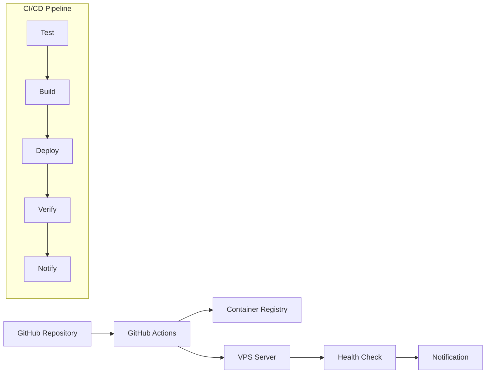

# CI/CD設計仕様書

## 1. 概要

「うちのきろく」アプリケーションの継続的インテグレーション・継続的デプロイメント（CI/CD）システムの設計仕様書です。

## 2. システム構成

### 2.1 全体アーキテクチャ



### 2.2 技術スタック

| コンポーネント | 技術選択 | バージョン | 用途 |
|----------------|----------|------------|------|
| CI/CD Platform | GitHub Actions | v4 | パイプライン実行 |
| Container Registry | GitHub Container Registry | - | Dockerイメージ管理 |
| Deployment Target | ConoHa VPS | Ubuntu 22.04 | 本番環境 |
| Container Runtime | Docker | 28.3.3 | コンテナ実行 |
| Orchestration | Docker Compose | v2.39.1 | サービス管理 |

## 3. CI/CDパイプライン設計

### 3.1 パイプライン概要

**トリガー条件:**
- `main`ブランチへのプッシュ
- 手動実行（workflow_dispatch）

**実行フロー:**
1. **Test Phase**: コード品質チェック
2. **Build Phase**: Dockerイメージビルド
3. **Deploy Phase**: 本番環境デプロイ
4. **Verify Phase**: デプロイ後検証
5. **Notify Phase**: 結果通知

### 3.2 各フェーズ詳細設計

#### 3.2.1 Test Phase

```yaml
test:
  runs-on: ubuntu-latest
  steps:
    - name: Checkout Code
    - name: Setup Node.js
    - name: Install dependencies  
    - name: Run tests
    - name: Build application
```

**品質チェック項目:**
- 依存関係インストール
- TypeScriptコンパイル
- Jest単体テスト実行
- Next.jsビルド確認

**成功条件:**
- 全テストがパス
- ビルドエラーなし
- TypeScript型チェック成功

#### 3.2.2 Build Phase

```yaml
build:
  needs: test
  outputs:
    image-tag: ${{ steps.meta.outputs.tags }}
    image-digest: ${{ steps.build.outputs.digest }}
```

**ビルド戦略:**
- マルチステージDockerビルド
- BuildKitキャッシュ活用
- コミットSHAベースのタグ付け

**成果物:**
- Dockerイメージ（ghcr.io/masa162/uch:${COMMIT_SHA}）
- イメージメタデータ
- ビルドキャッシュ

#### 3.2.3 Deploy Phase

```yaml
deploy:
  needs: build
  steps:
    - name: Deploy to VPS
    - name: Health Check with Timeout
    - name: Rollback on Failure
```

**デプロイ戦略:**
- Blue-Green風デプロイ
- ヘルスチェック付きデプロイ
- 自動ロールバック機能

**デプロイ手順:**
1. 現在の設定をバックアップ
2. 新しいイメージをプル
3. 設定ファイル更新（PostgreSQL環境変数含む）
4. 既存プロセスの強制終了（ポート占有解決）
5. ポート解放待機（最大30秒）
6. サービス再起動
7. ヘルスチェック実行（リトライ機能付き）
8. 失敗時の自動ロールバック

#### 3.2.4 Verify Phase

**検証項目:**
- コンテナヘルスチェック（フィルタ修正: `name=my-`）
- アプリケーションエンドポイント確認（リトライ付き）
- データベース接続確認
- 主要ページアクセス確認

**検証タイムアウト:**
- ヘルスチェック: 5回リトライ、各10秒間隔
- 全体タイムアウト: 300秒

**検証の改善点 (2025-08-24):**
- ヘルスチェックエンドポイントの5回リトライ機能追加
- コンテナ名フィルタの修正（`uch_` → `my-`）
- PostgreSQL初期化待機時間の考慮

#### 3.2.5 Notify Phase

**通知条件:**
- デプロイ成功時: INFO レベル
- デプロイ失敗時: ERROR レベル
- ロールバック実行時: WARNING レベル

## 4. エラーハンドリング設計

### 4.1 フェーズ別エラー処理

| フェーズ | エラー種類 | 処理方針 | リトライ |
|----------|------------|----------|----------|
| Test | ビルドエラー | パイプライン停止 | なし |
| Build | イメージビルド失敗 | パイプライン停止 | 1回 |
| Deploy | ポート占有エラー | プロセス強制終了後再試行 | 1回（30秒待機付き） |
| Deploy | PostgreSQL設定エラー | 環境変数自動修正 | なし |
| Deploy | デプロイ失敗 | 自動ロールバック | なし |
| Verify | ヘルスチェック失敗 | 5回リトライ後ロールバック | 5回（各10秒間隔） |

### 4.2 自動ロールバック機能

**ロールバック条件:**
- デプロイ後300秒以内にヘルスチェックが成功しない
- アプリケーションエンドポイントが応答しない
- データベース接続が失敗する

**ロールバック処理:**
```bash
# バックアップから設定復元
cp $BACKUP_DIR/docker-compose.prod.yml ./

# 前回のイメージで再起動
docker compose -f docker-compose.prod.yml up -d --force-recreate

# ヘルスチェック確認
curl -f http://localhost:3000/api/health
```

## 5. セキュリティ設計

### 5.1 認証・認可

**GitHub Secrets管理:**
- `CR_PAT`: GitHub Container Registry アクセストークン
- `VPS_HOST`: VPSサーバーIPアドレス  
- `VPS_USER`: VPSログインユーザー
- `VPS_SSH_KEY`: SSH秘密鍵

**アクセス制御:**
- GitHub Actionsは読み取り専用＋パッケージ書き込み権限
- VPS SSH接続は専用キーペアを使用
- Container Registryは認証済みアクセスのみ

### 5.2 通信セキュリティ

**データ暗号化:**
- SSH接続: RSA-4096キー
- HTTPS通信: TLS 1.3
- Container Registry: HTTPS + Token認証

## 6. 監視・ログ設計

### 6.1 CI/CDパイプライン監視

**監視項目:**
- パイプライン実行時間
- 各フェーズ成功率
- デプロイ頻度
- ロールバック発生率

**アラート条件:**
- デプロイ失敗時: 即座に通知
- パイプライン実行時間が15分超過
- 24時間以内に3回以上のロールバック

### 6.2 ログ管理

**ログ種類:**
- GitHub Actions実行ログ
- VPSデプロイログ
- アプリケーションログ
- ヘルスチェックログ

**ログ保持期間:**
- CI/CDログ: 30日間
- デプロイログ: 90日間
- エラーログ: 1年間

## 7. パフォーマンス要件

### 7.1 実行時間目標

| フェーズ | 目標時間 | 最大許容時間 |
|----------|----------|--------------|
| Test | 3分 | 5分 |
| Build | 5分 | 8分 |
| Deploy | 3分 | 10分 |
| Verify | 2分 | 5分 |
| **合計** | **13分** | **28分** |

### 7.2 キャッシュ戦略

**Dockerビルドキャッシュ:**
- GitHub Actions Cache を使用
- レイヤーキャッシュで30-50%の短縮を目標

**依存関係キャッシュ:**
- Node.jsパッケージキャッシュ
- Docker Buildxキャッシュ

## 8. 災害復旧設計

### 8.1 バックアップ戦略

**バックアップ対象:**
- デプロイ前の設定ファイル
- 現在稼働中のDockerイメージ情報
- データベース状態（必要に応じて）

**復旧手順:**
1. 失敗したデプロイを特定
2. バックアップディレクトリから設定復元
3. 前回正常稼働イメージで再起動
4. ヘルスチェック確認

### 8.2 手動復旧手順

**緊急時の手動デプロイ:**
```bash
# VPSに直接ログイン
ssh -i key.pem root@160.251.136.92

# 手動でコミット指定デプロイ
cd /home/nakayama/uch
COMMIT_SHA=[安全なコミットSHA]
sed -i "s|ghcr.io/masa162/uch:[^[:space:]]*|ghcr.io/masa162/uch:${COMMIT_SHA}|g" docker-compose.prod.yml
docker compose -f docker-compose.prod.yml up -d
```

## 9. 運用・メンテナンス

### 9.1 定期メンテナンス

**月次タスク:**
- CI/CD実行ログ分析
- パフォーマンス指標レビュー
- セキュリティアップデート確認
- バックアップ戦略見直し

**四半期タスク:**
- パイプライン設計見直し
- 新技術の適用検討
- 災害復旧テスト実施

### 9.2 アップグレード戦略

**GitHub Actions Runner更新:**
- ubuntu-latest の定期確認
- Actions バージョン固定管理

**Docker/Compose更新:**
- VPS上のバージョン管理
- 後方互換性確認

## 10. 制約事項・前提条件

### 10.1 技術的制約

- VPS は単一インスタンス（冗長化なし）
- ダウンタイムを伴うデプロイメント
- GitHub Actions の月次実行時間制限

### 10.2 運用制約

- デプロイは営業時間外推奨
- 重要な変更は事前告知が必要
- 緊急時対応は手動介入が必要

## 11. 今後の拡張計画

### 11.1 短期改善 (3ヶ月以内)

- [ ] Discord/Slack通知統合
- [ ] パフォーマンス監視ダッシュボード
- [ ] 自動化テストカバレッジ向上

### 11.2 中期改善 (6ヶ月以内)

- [ ] ブルー・グリーンデプロイメント
- [ ] 複数環境対応（staging/production）
- [ ] Infrastructure as Code (Terraform)

### 11.3 長期改善 (1年以内)

- [ ] Kubernetes移行検討
- [ ] マルチクラウド対応
- [ ] マイクロサービス化準備

## 12. トラブルシューティング履歴

### 12.1 ポート3000競合問題 (2025-08-24)

**問題概要:**
デプロイ時に「address already in use」エラーが発生し、コンテナ起動に失敗。

**原因分析:**
- VPS上でnext-server プロセスがポート3000を占有
- `docker compose down` だけではプロセスが完全に終了していない
- 短い待機時間（5秒）では不十分

**解決策実装:**
```bash
# 1. ポート占有プロセスの強制終了
sudo fuser -k 3000/tcp || true

# 2. ポート解放の確認ループ（最大30秒）
timeout=30
while [ $timeout -gt 0 ]; do
    if ! ss -tulpn | grep -q :3000; then
        echo "✅ Port 3000 is now free"
        break
    fi
    sleep 2
    timeout=$((timeout - 2))
done
```

### 12.2 PostgreSQL初期化失敗問題 (2025-08-24)

**問題概要:**
PostgreSQLコンテナが「Database is uninitialized and superuser password is not specified」エラーで起動失敗。

**原因分析:**
- `.env` ファイルに `POSTGRES_PASSWORD` 等の必須環境変数が未定義
- `DATABASE_URL` の認証情報が不完全

**解決策実装:**
```bash
# 環境変数の自動設定
if ! grep -q "POSTGRES_PASSWORD" .env 2>/dev/null; then
    echo "DATABASE_URL=\"postgresql://postgres:password@db:5432/uch_db\"" > .env.tmp
    echo "POSTGRES_DB=uch_db" >> .env.tmp
    echo "POSTGRES_USER=postgres" >> .env.tmp
    echo "POSTGRES_PASSWORD=password" >> .env.tmp
    # 既存設定の保持
    tail -n +2 .env >> .env.tmp
    mv .env.tmp .env
fi
```

### 12.3 ヘルスチェック検証問題 (2025-08-24)

**問題概要:**
- コンテナ名フィルタ (`uch_`) が実際の名前と不一致
- ヘルスチェックが単発実行で失敗しやすい

**解決策実装:**
- フィルタを `name=my-` に修正
- ヘルスチェックに5回リトライ機能を追加
- PostgreSQL初期化時間を考慮した待機処理

---

## 更新履歴

- **2025-08-20**: 初版作成
- **2025-08-24**: デプロイメント安定性向上の修正
  - ポート3000競合問題の解決
  - PostgreSQL環境変数設定の追加
  - ヘルスチェック検証の改善
  - デプロイ前のプロセス強制終了機能追加

## 関連ドキュメント

- [本番運用ガイド](../management/operations/PRODUCTION_OPERATIONS.md)
- [GitHub VPS関連仕様書](./github_vps関連仕様書.md)
- [基本設計書](./基本設計書v1.md)