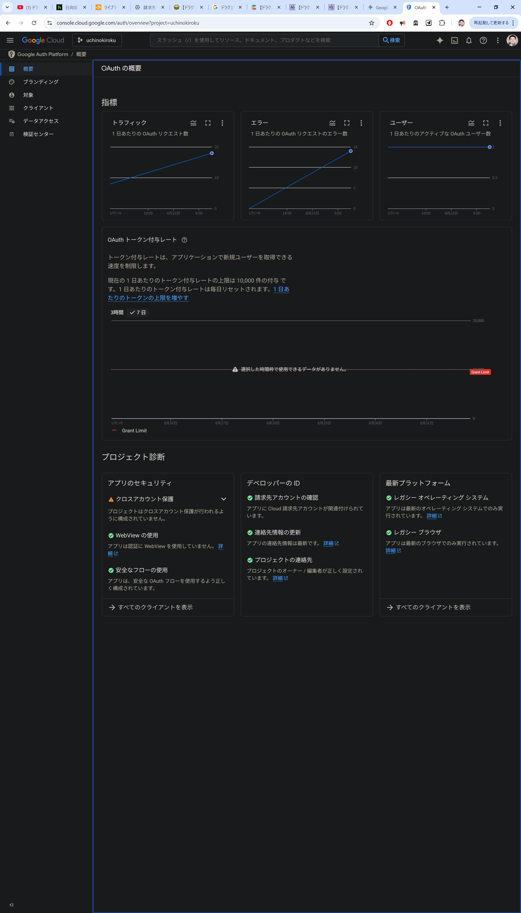
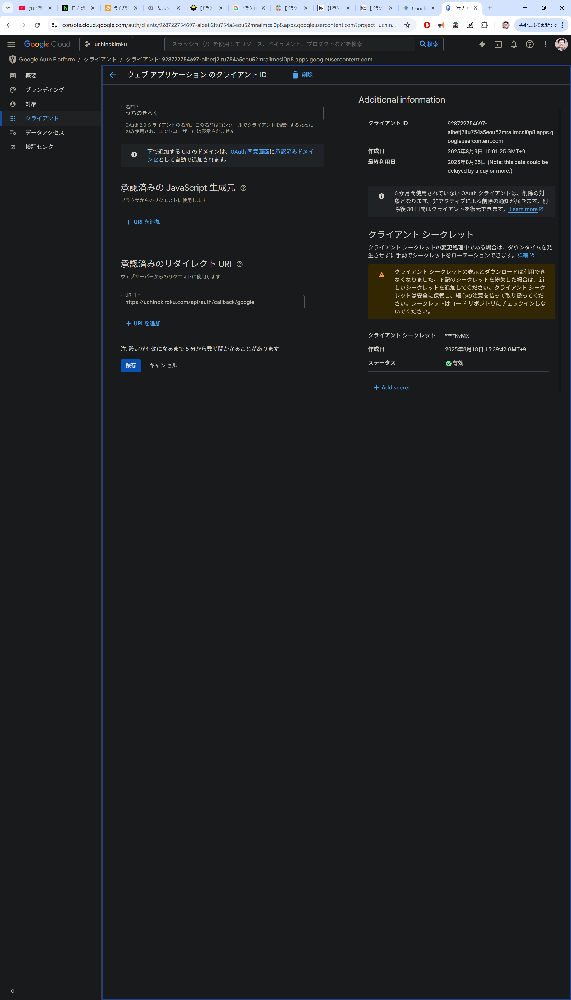

今日の目標
ToDo
うちのきろく＿家族用ブログ、
UI完成度70%、
バックエンド、運用フロー完成度70%、
コンテンツ移植度20％
それぞれ、あと３Hくらいずつみていけば、終わりそうかな。

骨格だけできたら、とにかくロンチしないといけない。
UIはあとから、どうとでも直していける、完璧でなく、とりあえずでできたら家族ロンチする、目標締め切り、18:00、8/31
本番URLを確認していました。
https://uchinokiroku.com/profile

プロフィール
名前　masayuki nakayama
ユーザー名　まさゆき
がひょうじされている

→シンプルにしたい
おそらく、現状認証をgoogleアカウントのみの連携にしてて
googleのアカウントネームがそのまま、名前に入っている
これは、「うちのきろく」
内ではユーザーに見えなくていい項目、
プロフィールで
「うちのきろく」内では”名前”でまさゆき、ゆみこ、かずき、中山房代など
なるべく、実生活上の”名前”をつかいたい。
これが、記事ページの書いた人、コメント、写真、動画upload者として、使われるイメージ

なのでプロフィールページ↓
”名前”　まさゆき

だけ表示する。

早速、claudecodeと私での作業を報告します。
再帰的にタスクをmanagementなどに記録お願いします

本番URLを確認していました。
https://uchinokiroku.com/gallery

メディア機能、
DBを新しくしたので、メディアアップロード、cloudflareR2へのやり取り、リサイズ、リネーム、webp化など、とDBへのリスト化このスキームが外れていると思う。一度調査

あなたは、PMです。
プロジェクトを俯瞰して

本番URLを確認していました。
https://uchinokiroku.com/profile

📱 プロフィール

プロフィール編集をクリックした画面

”名前”　まさゆき

だけ表示する。
ユーザー名は非表示にする
ユーザー名は「うちのきろく」内ではユーザーに意識させない。
名前とユーザー名があると混同し混乱するので、

https://uchinokiroku.com/articles/20250824001
記事ページ確認していました。

”名前”と”ユーザー名”はどのような設定になっているのでしょうか？
→シンプルにしたい
おそらく、現状認証をgoogleアカウントのみの連携にしてて
googleのアカウントネームがそのまま、名前に入っている
これは、「うちのきろく」
内ではユーザーに見えなくていい項目、
プロフィールで
「うちのきろく」内では”名前”でまさゆき、ゆみこ、かずき、中山房代など
なるべく、実生活上の”名前”をつかいたい。
これが、記事ページの書いた人、コメント、写真、動画upload者として、使われるイメージ

このあたり、調査報告お願いします

***

調査、提案ありがとうございます。
入れ違いで、私とclaudecodeでの作業があったので、先に報告を済ませます。
その上で、確認なのですが、既存の、Googleアカウント名がDBのUser.nameに、、のロジックはそのままでいいでしょうね。質問なのですが、結局はgoogleのアカウントが認証に使われていますよね。
これは、googleのユニークIDとしての、例えば、belong2jazz@gmail.com
はgoogleとしても普遍で、あるけど、googleの中では、「ニックネーム」的な？表示名ですよね。
ユーザー次第で、belong2jazz@gmail.comは普遍ユニークIDだけど、「ニックネーム」はmasayukiにしたり、masa162にしたり、google内で設定してたりしそうだな、と思って、
google　Authの仕組み的にも、belong2jazz@gmail.comを普遍ユニークIDとして、認証してるかたちですもんね。
認証通った後は、「うちのきろく」は独自のユニークIDをDBにもってるんでしょうか？

解説してもらって、不安が解消しました。
ありがとうございます、提案してもらった、displayNameが合理的だと理解できました。
では、タスク作成お願いします。

では、現在あるカラムとして
User.name
name
displayName

ですが、「うちのきろく」でのユニークIDが確実にあって、それが、記事にも、写真などにも紐づくし、
なので、表示に返す用のdisplayNameだけ、あれば良さそうですかね？
ユーザーには”名前”として、displayNameだけあればよくて、ほかは非表示にしておけばいいから、結果UIUXは変わんないけど、開発側としては重複しそうなカラムは明示的に廃棄しておいたほうがいいように経験的に感じますが、どうでしょうか？
デフォルトとして、googleから、User.nameは受け取っておいて、一回も、ユーザーには意識させない＿という方法もあるかな。

ありがとうございます、案②：`name` はDBに保持し、UI/ロジックでは `displayName` のみを使用する
を採用します。

これなら、TSK-093をそのまま、進めればいいですね。
作業したら報告します。

/Users/nakayamamasayuki/Documents/GitHub/uch/docs/management/tasks
にMD形式でタスク出力お願いします

しかし、経験的にやはり、使ってなくて活かしてあるみたいなカラムがややこしくあるのは
、運用してくと、ちょっとストレスになるんですよね。。
このあたり、スムーズにする、tipsってありますかね。

仕様書に書いておくとかっていう感じでしょうか？

ありがとうございます、上記に入れ違いで、完了した項目を先に報告します。
あと、ファイルうつしました。/Users/nakayamamasayuki/Documents/GitHub/uch/docs/management/tasks/WR250831-093_add_display_name.md
そのうえで、tipsありがとうございます、これを採用します。
追加のタスク作成お願いします

質問なのですが、フロントエンドのコードではなく、
今はDB関連を編集、整えていますね。

これはgithub、pushでvpsに反映される？
prismaはプロジェクト内のファイルだから、反映されそうだけど、
DB　volumeに関わるところは、VPSで直接、SSHキー接続して作業するかたちでしょうか？

では、ここで一度、

本番URLを確認していました。
https://uchinokiroku.com/gallery

メディア機能、
DBを新しくしたので、メディアアップロード、cloudflareR2へのやり取り、リサイズ、リネーム、webp化など、とDBへのリスト化このスキームが外れていると思う。一度調査

では、さきほど少し、いじった、メディア周りのDB調整もここで反映されるのでしょうか？

気付いた点フィードバックします。
https://uchinokiroku.com/

アクセス、ゲストでログインすると、
ローカルhttp://localhost:3000/api/auth/error?error=%0AInvalid%20%60prisma.user.findFirst()%60%20invocation%3A%0A%0A%0AThe%20column%20%60users.displayName%60%20does%20not%20exist%20in%20the%20current%20database.
を参照してしまっている？

先にすすめない

googleでログインも
https://accounts.google.com/signin/oauth/error/v2?authError=ChVyZWRpcmVjdF91cmlfbWlzbWF0Y2gSsAEKWW91IGNhbid0IHNpZ24gaW4gdG8gdGhpcyBhcHAgYmVjYXVzZSBpdCBkb2Vzbid0IGNvbXBseSB3aXRoIEdvb2dsZSdzIE9BdXRoIDIuMCBwb2xpY3kuCgpJZiB5b3UncmUgdGhlIGFwcCBkZXZlbG9wZXIsIHJlZ2lzdGVyIHRoZSByZWRpcmVjdCBVUkkgaW4gdGhlIEdvb2dsZSBDbG91ZCBDb25zb2xlLgogIBptaHR0cHM6Ly9kZXZlbG9wZXJzLmdvb2dsZS5jb20vaWRlbnRpdHkvcHJvdG9jb2xzL29hdXRoMi93ZWItc2VydmVyI2F1dGhvcml6YXRpb24tZXJyb3JzLXJlZGlyZWN0LXVyaS1taXNtYXRjaCCQAyo-CgxyZWRpcmVjdF91cmkSLmh0dHA6Ly9sb2NhbGhvc3Q6MzAwMC9hcGkvYXV0aC9jYWxsYmFjay9nb29nbGUypAIIARKwAQpZb3UgY2FuJ3Qgc2lnbiBpbiB0byB0aGlzIGFwcCBiZWNhdXNlIGl0IGRvZXNuJ3QgY29tcGx5IHdpdGggR29vZ2xlJ3MgT0F1dGggMi4wIHBvbGljeS4KCklmIHlvdSdyZSB0aGUgYXBwIGRldmVsb3BlciwgcmVnaXN0ZXIgdGhlIHJlZGlyZWN0IFVSSSBpbiB0aGUgR29vZ2xlIENsb3VkIENvbnNvbGUuCiAgGm1odHRwczovL2RldmVsb3BlcnMuZ29vZ2xlLmNvbS9pZGVudGl0eS9wcm90b2NvbHMvb2F1dGgyL3dlYi1zZXJ2ZXIjYXV0aG9yaXphdGlvbi1lcnJvcnMtcmVkaXJlY3QtdXJpLW1pc21hdGNo&client_id=928722754697-albetj2ltu754a5eou52mrailmcsi0p8.apps.googleusercontent.com&flowName=GeneralOAuthFlow

となって認証エラーなる。

ローカル環境のものが反映されてる？
古い設定でしょうか？
調査お願いします

フィードバックします。
http://160.251.136.92:3000
にアクセス、表示される。

ゲストでログイン機能しない。

googleでサインイン、
認証エラーが発生しました。と表示される。

uchinokiroku.comが正常に機能してるからまあOK,
おそらく、google　authで設定してるのは、カスタムドメインだけだから、
あとあと、余裕があれば作業する、保留で良さそうですね

フィードバックします。
https://uchinokiroku.com/profile
プロフィールの読み込みに失敗しました。と表示される。

気付いた点フィードバックします。
https://uchinokiroku.com/

認証ができていません。
ゲストでログインおすと、http://localhost:3000/api/auth/error?error=%0AInvalid%20%60prisma.user.findFirst()%60%20invocation%3A%0A%0A%0AThe%20column%20%60users.displayName%60%20does%20not%20exist%20in%20the%20current%20database.

となります。

buildが古いのでしょうか？

また、googleサインインもエラーです。
キャッシュでしょうか？

https://uchinokiroku.com/profile
をたたいても、やはりログインできていない状態です

エラー 400: redirect_uri_mismatch

/Users/nakayamamasayuki/Documents/GitHub/uch/docs/仕様書/DB設計仕様書v1.0.md
/Users/nakayamamasayuki/Documents/GitHub/uch/docs/仕様書/docker設定書.md

先週dockerに関して、いろいろ挑戦しながらこのあたり、刷新したり、しました。
齟齬がないか調査お願いします

https://uchinokiroku.com/profile
アクセスしました。例のエラーです。

Google にログイン
アクセスをブロック: このアプリのリクエストは無効です

belong2jazz@gmail.com
このアプリが無効なリクエストを送信したため、ログインできません。しばらくしてからもう一度お試しいただくか、この問題についてデベロッパーにお問い合わせください。 このエラーの詳細
このアプリのデベロッパーの場合は、エラーの詳細をご確認ください。
エラー 400: redirect_uri_mismatch
‪日本語‬
ヘルプ
プライバシー
規約

https://uchinokiroku.com/
アクセスしました。

同様のエラーです
エラー 400: redirect_uri_mismatch

この30日間くらい、実はずっと、この認証が足を引っ張ってて、開発が進まないことが、ストレスでした。
おおくは、古いdockerイメージがvpsで参照され続けていたのですが、今回はどうでしょうか？

プロジェクトオーナーのわたしが、コンテクストを把握していないのが問題なのですが、
これは、8/24、先週とまったく同じ事象なのです。
geminiCLI＞原因がわかりません、
claudecodeはさらにコンテクスト保持の機能が低いので、なおさら、
結果、
今回と同様に、docker、DBvolumeもクリーンにして始めたというのが8/24だったのです。

このあたりナレッジベースに言語化できていない私の責任ですね

しかし、もう一度、このあたり、ナレッジベースを見返してみませんか？

今日午前中には、通っていた設定が、通らなくなる

https://uchinokiroku.com/auth/signin
にアクセスしても、認証が通りません。
エラーになります。

ローカルのhttp://localhost:3000/api/auth/error?error=%0AInvalid%20%60prisma.user.findFirst()%60%20invocation%3A%0A%0A%0AThe%20column%20%60users.displayName%60%20does%20not%20exist%20in%20the%20current%20database.
がm参照されているのでしょうか？

調査お願いします

報告します。
https://uchinokiroku.com/profile 
を直接たたくと、
うちのきろく ロゴ画像
記事を検索...

ゲ
ゲストユーザー
ゲスト
@guest
🔍 発見とメモ
🏷️ 人気のタグ
家族
思い出
旅行
料理
季節
プロフィールの読み込みに失敗しました

と表示できました。

ゲストとして入ったのでしょうか？
https://uchinokiroku.com/auth/signin
再度アクセスすると、

googleでのサインインはできませんでした。
エラー 400: redirect_uri_mismatch

報告します。さきほどとまったく同じような状況ですね。
https://uchinokiroku.com/profile
ゲストとして入ります。

https://uchinokiroku.com/auth/signin
再度アクセスすると、

googleでのサインインはできませんでした。
エラー 400: redirect_uri_mismatch

https://accounts.google.com/signin/oauth/error/v2?authError=ChVyZWRpcmVjdF91cmlfbWlzbWF0Y2gSsAEKWW91IGNhbid0IHNpZ24gaW4gdG8gdGhpcyBhcHAgYmVjYXVzZSBpdCBkb2Vzbid0IGNvbXBseSB3aXRoIEdvb2dsZSdzIE9BdXRoIDIuMCBwb2xpY3kuCgpJZiB5b3UncmUgdGhlIGFwcCBkZXZlbG9wZXIsIHJlZ2lzdGVyIHRoZSByZWRpcmVjdCBVUkkgaW4gdGhlIEdvb2dsZSBDbG91ZCBDb25zb2xlLgogIBptaHR0cHM6Ly9kZXZlbG9wZXJzLmdvb2dsZS5jb20vaWRlbnRpdHkvcHJvdG9jb2xzL29hdXRoMi93ZWItc2VydmVyI2F1dGhvcml6YXRpb24tZXJyb3JzLXJlZGlyZWN0LXVyaS1taXNtYXRjaCCQAyo-CgxyZWRpcmVjdF91cmkSLmh0dHA6Ly9sb2NhbGhvc3Q6MzAwMC9hcGkvYXV0aC9jYWxsYmFjay9nb29nbGUypAIIARKwAQpZb3UgY2FuJ3Qgc2lnbiBpbiB0byB0aGlzIGFwcCBiZWNhdXNlIGl0IGRvZXNuJ3QgY29tcGx5IHdpdGggR29vZ2xlJ3MgT0F1dGggMi4wIHBvbGljeS4KCklmIHlvdSdyZSB0aGUgYXBwIGRldmVsb3BlciwgcmVnaXN0ZXIgdGhlIHJlZGlyZWN0IFVSSSBpbiB0aGUgR29vZ2xlIENsb3VkIENvbnNvbGUuCiAgGm1odHRwczovL2RldmVsb3BlcnMuZ29vZ2xlLmNvbS9pZGVudGl0eS9wcm90b2NvbHMvb2F1dGgyL3dlYi1zZXJ2ZXIjYXV0aG9yaXphdGlvbi1lcnJvcnMtcmVkaXJlY3QtdXJpLW1pc21hdGNo&client_id=928722754697-albetj2ltu754a5eou52mrailmcsi0p8.apps.googleusercontent.com&flowName=GeneralOAuthFlow
結局、上のようになって認証できません。
キャッシュとかですかね？
もしくはvpsでbuildできてない？

https://uchinokiroku.com
認証エラーが発生しました。

https://uchinokiroku.com/auth/signin?callbackUrl=https%3A%2F%2Fuchinokiroku.com%2F&error=Callback

https://uchinokiroku.com
認証エラーが発生しました。
https://uchinokiroku.com/auth/signin?callbackUrl=https%3A%2F%2Fuchinokiroku.com%2F&error=Callback

buildしなおせばいいですかね？
キャッシュとかですかね？

https://uchinokiroku.com
認証エラーが発生しました。
https://uchinokiroku.com/auth/signin?callbackUrl=https%3A%2F%2Fuchinokiroku.com%2F&error=Callback

https://uchinokiroku.com/api/auth/error?error=%0AInvalid%20%60prisma.user.findFirst()%60%20invocation%3A%0A%0A%0AThe%20table%20%60public.users%60%20does%20not%20exist%20in%20the%20current%20database.
さっきよりはマシになってますね。
local3000とかじゃないから

これもなんかしらのバグなんですかね？

やったー、入れたー

なにがやばいかって、私が許可してないのに、DBvolumeごと消しましたね。
自然言語m中のものを実行しましょう、みたいに受け取ったのかな？
開発中だから、まだテストデータしかない状況だからよかったけど、
運用フェーズだったら、コンテンツなくなっちゃいますからね。
コンテンツオーナーとしては、DB
とくに「うちのきろく」
家族との思い出のコンテンツは、いってみれば
自分の命以上に大切なものなんです

責任は全部私に帰結します。
コンテクスト、プロジェクト、変数、ポートなど
管理すべきものがされていないのは、私の欠陥なのです。

そこで、今回の事象を把握しておきたいと思います。

googleauthで通らなかったのはなぜ？
ということ、
これは、「うちのきろく」を長期安定運用するための
最重要課題であり、これを解決コントロールできれば
なによりの情報資産なのです

今後、さすがに記事が追加されるたびに、認証できなくなるということはないですよね。
プロフィールに関連しそうなカラムを調整したら、問題はおこりえる？

フィードバックします。
https://uchinokiroku.com/gallery
⚠️ 処理状況の取得に失敗しました
⚠️ メディアの取得に失敗しました

と表示されます。

そりゃそうだ、さっき誰かが、DBvolume派手に消したんだからね

そんなもんねーよ。
まだ開発段階だし、とくにバックアップとかもしてねーよ、
prismaから、お前が消す前の状態に戻せたりはしないの？

というか、どういうつもりでdbvlume消したんだよ

いや別にまだ開発段階だから、dbvolumeは空でいいのよ。
prismaを参照して、カラムを復旧してほしいのよ

プロジェクトオーナーの人間の私が全部責任あるのよ。
代行ツールはコンテキスト保持できないんだから、
それがよくわかったよ、あらためて、今回のことで

というか、DBvolumeクリアしたら、そりゃカラムもクソもないから、認証でｍつかってた項目も通らないよな
その程度の予測もできないんだな、geminiCLIは
それでいて、知識あるみたいな口調でやってきやがるから、ストレス貯まるんだよな

https://accounts.google.com/signin/oauth/error/v2?authError=ChVyZWRpcmVjdF91cmlfbWlzbWF0Y2gSsAEKWW91IGNhbid0IHNpZ24gaW4gdG8gdGhpcyBhcHAgYmVjYXVzZSBpdCBkb2Vzbid0IGNvbXBseSB3aXRoIEdvb2dsZSdzIE9BdXRoIDIuMCBwb2xpY3kuCgpJZiB5b3UncmUgdGhlIGFwcCBkZXZlbG9wZXIsIHJlZ2lzdGVyIHRoZSByZWRpcmVjdCBVUkkgaW4gdGhlIEdvb2dsZSBDbG91ZCBDb25zb2xlLgogIBptaHR0cHM6Ly9kZXZlbG9wZXJzLmdvb2dsZS5jb20vaWRlbnRpdHkvcHJvdG9jb2xzL29hdXRoMi93ZWItc2VydmVyI2F1dGhvcml6YXRpb24tZXJyb3JzLXJlZGlyZWN0LXVyaS1taXNtYXRjaCCQAyo-CgxyZWRpcmVjdF91cmkSLmh0dHA6Ly9sb2NhbGhvc3Q6MzAwMC9hcGkvYXV0aC9jYWxsYmFjay9nb29nbGUypAIIARKwAQpZb3UgY2FuJ3Qgc2lnbiBpbiB0byB0aGlzIGFwcCBiZWNhdXNlIGl0IGRvZXNuJ3QgY29tcGx5IHdpdGggR29vZ2xlJ3MgT0F1dGggMi4wIHBvbGljeS4KCklmIHlvdSdyZSB0aGUgYXBwIGRldmVsb3BlciwgcmVnaXN0ZXIgdGhlIHJlZGlyZWN0IFVSSSBpbiB0aGUgR29vZ2xlIENsb3VkIENvbnNvbGUuCiAgGm1odHRwczovL2RldmVsb3BlcnMuZ29vZ2xlLmNvbS9pZGVudGl0eS9wcm90b2NvbHMvb2F1dGgyL3dlYi1zZXJ2ZXIjYXV0aG9yaXphdGlvbi1lcnJvcnMtcmVkaXJlY3QtdXJpLW1pc21hdGNo&client_id=928722754697-albetj2ltu754a5eou52mrailmcsi0p8.apps.googleusercontent.com&flowName=GeneralOAuthFlow

https://uchinokiroku.com/auth/signin?callbackUrl=https%3A%2F%2Fuchinokiroku.com%2F&error=Callback

リクエスト URL
https://accounts.google.com/o/oauth2/v2/auth?client_id=928722754697-albetj2ltu754a5eou52mrailmcsi0p8.apps.googleusercontent.com&scope=openid%20email%20profile&response_type=code&redirect_uri=https%3A%2F%2Fuchinokiroku.com%2Fapi%2Fauth%2Fcallback%2Fgoogle&state=VRb7TYyCJcSErTY0rMc4uIyOs7sJdfwggtf_DVuqdoY&code_challenge=woNmagv4bVTzWokbaGef9qcy3f1DpBJp-oIGlwzfUVw&code_challenge_method=S256
リクエスト メソッド
GET
ステータス コード
302 Found
リモート アドレス
173.194.174.84:443
参照ポリシー
strict-origin-when-cross-origin

https://uchinokiroku.com/api/auth/error?error=%0AInvalid%20%60prisma.user.findFirst()%60%20invocation%3A%0A%0A%0AAuthentication%20failed%20against%20database%20server%2C%20the%20provided%20database%20credentials%20for%20%60uch_user%60%20are%20not%20valid.%0A%0APlease%20make%20sure%20to%20provide%20valid%20database%20credentials%20for%20the%20database%20server%20at%20the%20configured%20address.

リクエスト URL
https://accounts.google.com/o/oauth2/v2/auth?client_id=928722754697-albetj2ltu754a5eou52mrailmcsi0p8.apps.googleusercontent.com&scope=openid%20email%20profile&response_type=code&redirect_uri=https%3A%2F%2Fuchinokiroku.com%2Fapi%2Fauth%2Fcallback%2Fgoogle&state=68UnKK_9bCJAvkQuzJ3FTD4quKIPv3yi3MEGvPCM-eM&code_challenge=euVsFq-hHhdnx_80OFFVDIZeZXIcdnYM2jUNaecu5hI&code_challenge_method=S256
リクエスト メソッド
GET
ステータス コード
302 Found
リモート アドレス
142.251.170.84:443
参照ポリシー
strict-origin-when-cross-origin

古いIPアドレスは、どうして参照されていたのでしょうか？
docker-compose.prod.yml
を修正してもらってので、もう古いIPアドレスは参照されないということですね。

古いIPアドレスがあるか、プロジェクト全部検索お願いします、
もしあれば、新しいものに修正お願いします

さきほどから少々geminiCLIの使い方に苦戦しています。

さきほどから、geminiCLIに代行させていた範囲で手違いがおこってました。。

手違いがおこってるのに、代行ツールという性質上、実作業を推し進めようとしますよ。
このあたりのコントロールができずに消耗しています。

それが、、あとで、geminiに報告共有しようと、思ってたんですが、terminal閉じちゃったんですよね。。
悔やまれます。これは完全に私のミスなんですけど

いや、もう完全に私の不注意だし、ツールを使いこなせていない、し、
プロジェクト管理をオーナーとしてやるのは、私の責任なのですが、

ちょっと、そのあたりの気持ちの整理もあわせて、少し雑談よりの相談になるんですが、、

じつは、プロジェクトがうまくいってなくて、
私としても、このm数週間同じようなエラーを根気よく対応しててもしんどいところもありつつ、
やってて

geminiCLIの提案と、そこでの行き詰まりがまったく同じように、
先週あったことを、まのあたりに、デジャヴをみて、私はストレスを抱えてしまいまして、

terminalに移す前の手元の自分のメモを共有しますね。

で、

先週も同じ用に行き詰まって、コンテナとdbvolumeクリーンにしてからやりましょう
とかいわれて、やって、
結局だめでした、

また同じ用に、いきづまりました。ｍ

わかりません、クリーンアップしましょう、
と今回また、行き着いたので、

やれやれ、と思うわけです。

反省点としては、自分も複数の代行ツール使ってしまってたりするのもいけなくて、

これは、通るじゃねーかよクソがというつもりで、
いわば、人間どうしでなら、

嫌味として、

claudeで解決した、ログを貼ったら、
geminiCLIは、自分が提案したものをすすめると解釈したのか、

DBvolumeを消したんだよね。。

うわーー、こいつやってるな、、
とあきれてて、

まあ、そういうもんだよな、俺がコントロールできてないからそりゃそうだ、と、

一周して、醒めた目で一方で見ることはできたんだけど、

でもう、笑えるようなそんな状況だから、ログあとで、ｍこれテキスト化して、webのgeminiに相談しよ、と思ってたんだけど、

terminal消したっていうそういう流れがまったんです。

ありがとうございます、
人間のバグ的なもので、言ってみたり、書き出したりすれば大抵のことは、OKなんですよね、
気持ちだけの問題ならなおさら、

で、私も自覚的な人間ですから、そのことも知っているし。

そのうえで、振り返ってみると、
自分でも、
なかなか、強い汚い言葉使いで、よくも嫌味をいったなと、笑

これは、人間→機械でおこる例ですよね

代行ツールをｍつかいながら、そのあたりのコンテキスト維持や、プロジェクト管理などを工夫した、数週間でした。

gemini.md
共有します、システムプロンプトからもそのことがわかってもらえるかもしれません。

しかし、それでも、PMとしてのペルソナを与える作戦はことごとく失敗に終わっています。
ほとんど、いまの仕組みでは、これは無理なんだなと、
現状の代行ツールの限界と現実
プロジェクトオーナーはそれをどう道具として使うかのラインが見えていたところでもありました。

おそらく今日の手元のメモと
gemini.md
によって、
この数週間での流れをその一端を共有できたかなと、
実はそれだけでも、私としては救われた部分はあるのです。

まるまる8月捨てたな、、なんにも進んでねえ、、と

1ヶ月やってようやく私は、代行ツールとのterminalログをimiとかmdファイル化する、

それを、web　geminiに共有して、
メタをつくる

それしかないんだと知るに至ったのです、ようやくスタートラインにたったのかもしれませんね

geminiCLIに代行させていたところで、uch_dev
の設計がされてしまったのでしょうか？
プロジェクトオーナーである私のの管理不足でした。

おそらく、geminiCLIが環境をクリーンにして再構成しようと試みてしまったのでしょう、、

これらの残渣や設定が残っていると、今後の開発、運用に妨げになりそうですね。

このあたり、DB、prismaに不要な設定がなされていないか調査お願いします

フィードバックします。
https://uchinokiroku.com/gallery

ファイルをアップロードをクリック
ローカルの画像を選択し、uploadおしても
アップロード完了！
AI執事がファイルを処理中です。下記の処理状況をご確認ください。
とは表示されるけど、なにもうごいてないっぽい

PMペルソナはまあ、現状無理があったということで、一回、このgemini.mdは廃棄したほうがいいですね。
もしくは、なにか教訓にいかせることがあるのでしょうか？

一度、この

ありがとうございます、upload処理遷移しましたが、メディアがあがってないのかな？
画面が変わらないです。
手動でリロードするかたちでしょうかね

リロードしても、状況かわりません。

とまってしまってますかね？

「

うちのきろく ロゴ画像
記事を検索...

M
masayuki nakayama
🔍 発見とメモ
🏷️ 人気のタグ
家族
思い出
旅行
料理
季節
📷 メディアギャラリー
アップロードされた写真・動画を閲覧できます

🤖 AI執事処理状況
処理中
1件のファイルが処理待ちです

合計
1
待機中
1
処理中
0
完了
0
推定残り時間: 約2分
💡 処理中は他のページに移動しても大丈夫です。AI執事がバックグラウンドで作業を続けます。
🔄 現在処理中のファイル
1件
⏳
ダウンロード.jpeg

image/jpeg • 8分経過

待機中
📋 最近のファイル
⏳
ダウンロード.jpeg

11.04 KB

8月31日 16:48
最適化済みメディア
AI執事により自動最適化
複数品質対応
ファイル名で検索...

新しい順

中品質
0件中 1-0件を表示
📷
メディアがありません
最初のファイルをアップロードしてください

🤖 AI執事の機能
自動画像最適化（WebP変換）
複数品質生成（高・中・サムネイル）
ファイルサイズ大幅削減
自動メタデータ管理
将来的なAI自動タグ付け対応
📋 対応ファイル形式
画像: JPEG, PNG, WebP, GIF
動画: MP4, MOV, AVI
最大サイズ: 100MB
最適化後: WebP (画像), MP4 (動画)
📊 あなたのメディア統計
ユーザー別の統計情報は今後実装予定です
」

今。windows環境で。本番 urlをチェックしてみました。
https://uchinokiroku.com/auth/signin
エラー 400: redirect_uri_mismatch

エラーが出ています。これも ブラウザのキャッシュが残っているのでしょうか？

自分のgoogleアカウント。
belong2jazz

終了。